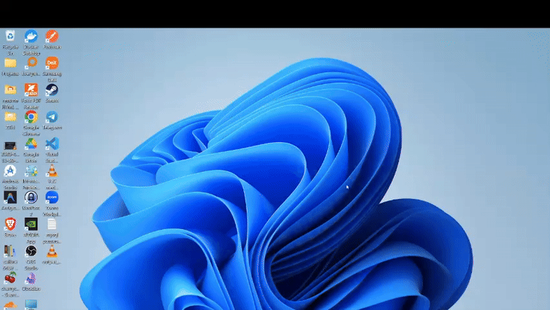

# DesktopSort

A modern desktop file organizer built with Electron, React, and Tailwind CSS.

<div align="center">
  
</div>

## Features

- 🗂️ **Smart File Organization** - Automatically categorize and organize desktop files
- 📁 **Category Management** - Files organized into Images, Documents, Videos, Audio, Archives, Code, Apps, and more
- 🔄 **Easy Restore** - One-click restore to return files to desktop
- 📊 **Dashboard** - Visual overview of file statistics and categories
- 🎨 **Modern UI** - Clean, responsive interface with dark/light theme support
- ⚡ **Fast & Efficient** - Native file icon display and smooth performance

## Tech Stack

- **Electron** - Cross-platform desktop application framework
- **React** - UI library
- **Tailwind CSS** - Utility-first CSS framework
- **Vite** - Fast build tool
- **Zustand** - State management
- **Framer Motion** - Animations

## Installation

```bash
# Install dependencies
npm install

# Run in development mode
npm run dev

# Build for production
npm run build
```

## Usage

1. Launch the application
2. Click "Organize Files" to sort your desktop files into categories
3. Browse organized files in the Files page
4. Use "Restore Desktop" to move files back to desktop

## Project Structure

```
DesktopSort/
├── src/
│   ├── main/           # Electron main process
│   ├── preload/        # Preload scripts
│   └── renderer/       # React frontend
│       ├── components/ # UI components
│       ├── pages/      # Page components
│       ├── stores/     # State management
│       └── assets/     # Styles and assets
├── electron-builder.yml
└── package.json
```

## License

MIT
